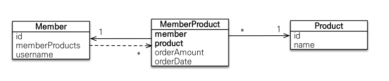

다대다 [N:N]
=========


관계형 데이터 베이스에서 다대다를 2개의 테이블만으로 구현할 수 없다.  
하지만 객체는 테이블과 다르게 객체 2개로 다대다 관계를 만들 수 있다.


### 6.4.1 다대다 : 단반향
```java

@Entity
public class Member{
    @Id
    @Column (name = "MEMBER_ID")
    private String id;
    
    private String username;
    
    @ManyToMany
    @JoinTable(
        name = "MEMBER_PRODUCT",
        joinColumns = @JoinColumn(name = "MEMBER_ID"),
        inverseJoinColumns = @JoinColumn( name = "PRODUCT_ID")
    )
    private List<Product>products = new ArrayList<Product>();
    ...
}


@Entity
public class Product {
    @Id
    @Column(name = "PRODUCT_ID")
    private String id;
    
    ...
}
```

* 회원 엔티티와 상품 엔티티를 `@ManyToMany`와 `@JoinTable`을 사용해서 연결 테이블(회원상품 테이블)을 맵핑했다.
  * `@JoinTable`의 속성
    * name : 연결 테이블을 지정한다.
    * joinColumns : 매핑할 조인 컬럼 정보를 지정한다. 연결 테이블이 바라보는 다른 테이블.
    * inverseJoinColumns : 반대 방향의 테이블과 매핑할 조인 컬럼 정보를 지정한다.
  * `@ManyToMany`로 매핑한 덕분에 다대다 관계를 사용할때는 MEMBER_PRODUCT Entity를 생성할 필요가 없다. 


위에서는 맵핑하는 법에 대해서 참고했다.  
이제는 저장과 탐색과정을 어떻게 하는지 알아보겠다.
```java
public void save(){
  Product productA = new Product();
  productA.setId("productA");
  productA.setName("상품A");
  em. persist(productA);
  
  Member member1 = new Member();
  member1.setId("member1");
  member1.setUsername("회원1");
  member1.getProducts().add(productA); // 연관관계 설정
  em.persis(memeber1);
}
```
위와 같이 연관관계를 설정했으므로 회원1을 저장할 때 MEMBER_PRODUCT 테이블에도 값이 저장된다.

```sql

Insert Into Product ...
Insert Into Member ...
Insert Into Member_Product...
```


```java
public void find(){
    
    Member member = em.find(Member.class, "member1");
    List<Product> products = member.getProducts(); //객체 그래프 탐색
    for ( Product product : products){
        System.out.println("product.name = " + product.getName());
    }
}

```

`member.getProducts()` 코드가 실행될떄 아래와 같은 SQL이 실행된다.
```sql

SELECT * FROM MEMBER_PRODUCT MP
INNER JOIN PRODUCT P ON MP.PRODUCT_ID=P.PRODUCT_ID
WHERE MP.MEMBER_ID=?
```


### 6.4.2 다대다 : 양반향

단방향에서는 Member에만 `@ManyToMany`만 적어주었다. 양방향 연관 관계를 위해 역방향인 Product에도 `@ManyToMany`를 적용하겠다.

```java
@Entity
public class Product {
 
    @Id
    private String id;
    
    @ManyToMany(mappedBy = "products") // 역방향추가
  private List<Member> members;
  ...
}
```

양방향 연관관계는 연관관계 편의 메소드를 추가해서 관리하는것이 편리하다.  
회원 Entity에 연관관계 편의 메소드를 추가한다.

```java
public void addProduct(Product product){
  ...
  products.add(product);
  product.getMembers().add(this);
          
}
```

연관관계 편의 메소드를 추가했으므로 다음처럼 간단히 양방향 연관관계를 설정하면 된다.
member.addProduct(product);

역방향 탐색
```java

public void findInverse(){
    Product product = em.find(Product.class, "productA");
    List<Member> members = product.getMembers();
    for ( Member member : members){
        System.out.println("member = " + member.getUsername());
    }
}
```

### 6.4.3 다대다 : 매핑의 한계와 극복, 연결 엔티티 사용.
실무에서 다대다 관계를 사용하기에는 어려움이 있다. 보통 연결 테이블에 부가적인 컬럼이 더 추가되기 때문.  
(현재 우리조도 order와 menu관계에서 수량이 추가되고 쿠폰이 추가된다.)
컬럼을 연결테이블에 추가하게되면 @ManyToMany를 사용하지 못한다.
  
위이미지 처럼 `@OneToMany` ->  <- `ManyToOne` -> Product 관계로 맺어줘야한다.

```java
//회원코드
@Entitiy
public class Member {
    @Id @Column(name = "MEMBER_ID")
    private String id;
    
    //역방향
  @OneToMany(mappedBy = "member")
  private List<MemberProduct> memberProducts;
  
  ...
}

//상품 코드
@Entity
public class Product {
    @Id @Column( name = "PRODUCT_ID")
    private String id;
    
    private String name;
    ...
}

// 회원상품코드
@Entity
@IdClass(MemberProductId.class)
public class MemberProduct{
    @Id
    @ManyToOne
    @JoinColumn(name = "MEMBER_ID")
    private Member member; // MemberProductId.member 와 연결

  @Id
  @ManyToOne
  @JoinColumn(name = "PRODUCT_ID")
  private Product product; // MemberProductId.member 와 연결
  
  private int orderAmount;
  ...
}

// 복합키 코드 (MemberProduct의 Id )
public class MemberProductId implements Serialzable{
    private String member;
    private String product;
    
    @Override
    public boolean equals(Object o){ ... }
  
    @Override
    public int hashCode(){ ... }
}
```

##### 복합키
* JPA에서 복합키를 사용하기 위해서는 별도의 식별자 클래스로 만들어야한다.
* Serializable을 구현해야한다.
* equals와 hashCode 메소드를 구현해야한다.
* 기본 생성자가 있어야한다.
* 식별자 클래스는 public이어야한다.
* @IdCLass를 사용하는 방법 외에 @EmbeddedId를 사용하는 방법도 있다.

##### 식별 관계
회원 상품은 회원과 상품의 기본키를 받아서 자신의 기본키로 사용한다. 이렇게 부모 테이블의 기본키를 받아서 자신의 기본키 + 외래키로 사용하는것을 데이터베이스 용어로 식별관계라고한다.
-> 그러니까 회원 입장에서는 회원상품에서 자신의 키를 기본키로, 상품의 키를 외래키로 사용한다는 것 같다.

? Serializable을 구현하는 이유는 4장에서 배웠던 기본키 관리중 시리얼라이즈를 구현하기 쉬워서 한건가?

@IdClass, @EmbeddedId를 통해 식별관계를 줄 수 있다.


```java

public void save(){
    
    //회원 저장
    Member member1 = new Member();
    member1.setId("member1");
    member1.setUsername("회원1");
    em.persist(member1);
    
    //상품 저장
    Product productA = new Product();
    productA.setId("productA");
    productA.setName("상품1");
    em.persist(productA);
    
    //회원 상품 저장
    MemberProduct memberProduct = new MemberProduct();
    memberProduct.setMember(member1); 
    memberProduct.setProduct(productA);
    memberProduct.setOrderAmount(2); //주문수량
    empersist(memberProduct);
}


public void find(){
    
    //기본 키 값 생성
    MemberProductId memberProductId = new MemberProductId();
    memberProductId.setMember("member1");
    memberProductId.setProduct("productA");
    
    MemberProduct memberProduct = em.find(MemberProduct.class, memberProductId);
    
    
    Member member = memberProduct.getMember();
    Product product = memberProduct.getProduct();
    
    System.out.println("member = " + member.getUsername());
    System.out.println("product = " + product.getName());
    System.out.println("orderAmount = " + memberProduct.getOrderAmount());
            

}
```


### 6.4.4 다대다 : 새로운 기본 키 사용.
복합키 없이 6.4.3에서 구현한 관계에서 DB에서 자동으로 생성해주는 대리 키를 Long 값으로 사용하는 것.
기존의 MEMBER_PRODUCT는 ORDER로 변경한다.

```java

@Entity
public class Order {
    @Id
    @Column(name = "ORDER_ID")
    private Long Id;
    
    @ManyToOne
    @JoinColumn(name="MEMBER_ID")
    private Member member;
    
    @ManyTonOne
    @JoinColumn(name = "PRODUCT_ID")
    private Product product;
    
    private int orderAmount;
    ...
}

```

```java
//save

Order order = new Order();
order.setMember(member1);
order.setProduct(productA);
order.setOrderAmount(2);
em.persist(order);


//find
Long orderId = 1L;
Order order = em.find(Order.class, orderId);

Member member = order.getMember();
Product product = order.getProduct();
```


### 6.4.5 다대다 연관관계 정리
식별 관계 : 받아온 식별자를 기본 키 + 외래 키로 사용한다.
비식별 관계 : 받아온 식별자는 외래 키로만 사용하고 새로운 식별자를 추가한다.


